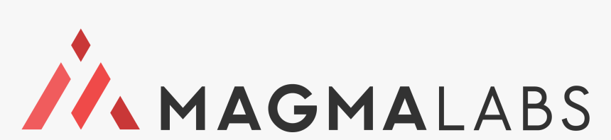

# Magma Clothing eStore

This `project` is part of `MagmaLabs' Solidus Course` for training Ruby on Rails Developers.

## About Magma Clothing

`Magma Clothing Inc.` is a company that manufactures and provides uniforms for different schools in México. To provide better service they need an e-commerce solution so their clients can acquire their products online.

The new system must support the following requirements:

- Product's price depends on size and color of each product
- Price also depends if bought individually or as wholesale
- Some schools require name printed on the tshirts, offer the ability to add custom data(printed tag) to the cart for some products during checkout
- Uniforms are specific for each school, thus, customers could potentially filter by 'compatibility'.
- Products must match gender, for example, a woman's shirts can not be mixed with men's jeans.
- Additional methods of payment are Oxxo Pay and Mercado Pago
- Tax calculation must consider that on Mexican border zone a different tax rate applies (8%)
- Schools must be able to pre-define sets of packages for their students, so customers by using a `magic-click` can load it. For example a school may define a set of 3 blue shirts, 2 withe shirts and 5 skirts for womans.
- [Magma Clothing product catalog is detailed here](#product-catalog)

## Required Workflow

1. Before you start coding you must work on an estimation for this project. [Detailed instructions for working on your project estimation are here.](/instructions/estimation)
2. Once finished, add a link to your estimation document on the [estimation section](#estimation)
3. Pick the features you are going to begin working on and add them to your Zehub project planner or similar
4. You will be working on 1-week length sprints
5. On Mondays you will work on your sprint planning
6. On Fridays you will have a demo session where you can show your progress
7. Use the #ml-learning slack channel for questions
8. Use the #support slack channel to request code review

## Estimation

- [See project estimation]()

## Recommended pactices:

1. Add Linters (Rubocop, Jslint, etc)
2. [Pull Request Flow](https://github.com/magma-labs/magmalabs-policies/blob/master/engineering/processes/pull-request-flow.md)
3. [Git flow with Rebase](https://gist.github.com/markreid/12e7c2203916b93d23c27a263f6091a0)

## Support Resources
- [Solidus Developers Guide](https://guides.solidus.io/developers/)

## Product Catalog

### 👩‍💼👚 Woman Shirt
  
| Size | Colors | Price | Wholesale Price| Wholesale Amount
| --- | --- | --- | --- | --- |
| Small | Red or Blue | $150 | $140 | 5
| Small | White  | $145 | $135 | 3
| Medium | Red or Blue | $160 | $145 | 5
| Medium | White  | $155 | $125 | 3
| Large | Red or Blue | $170 | $150 | 5
| Large | White  | $168 | $142 | 3

### 👩‍💼👗 Woman Skirt

| Size | Colors | Price | Wholesale Price| Wholesale Amount
| --- | --- | --- | --- | --- |
| Small | Brown or Gray | $200  | $190 | 6
| Small | White  | $180 | $175 | 4
| Medium | Red or Blue | $225  | $215 | 6
| Medium | White  | $200 | $190 | 4
| Large | Red or Blue | $250 | $220 | 6
| Large | White  | $245  | $240 | 4

### 🧑‍💼👕 Men Shirt
  
| Size | Colors | Price | Wholesale Price| Wholesale Amount
| --- | --- | --- | --- | --- |
| Small | Green or Blue | $150 | $140 | 6
| Small | White  | $145 | $135 | 6
| Medium | Green or Blue | $160 | $145 | 6
| Medium | White  | $155 | $125 | 4
| Large | Green or Blue | $170 | $150 | 6
| Large | White  | $168 | $142 | 4

### 🧑‍💼👖 Men Jeans

| Size | Colors | Price | Wholesale Price| Wholesale Amount
| --- | --- | --- | --- | --- |
| Small | Brown or Gray | $200  | $190 | 6
| Small | White  | $180 | $175 | 4
| Medium | Red or Blue | $225  | $215 | 6
| Medium | White  | $200 | $190 | 4
| Large | Red or Blue | $250 | $220 | 6
| Large | White  | $245  | $240 | 4
