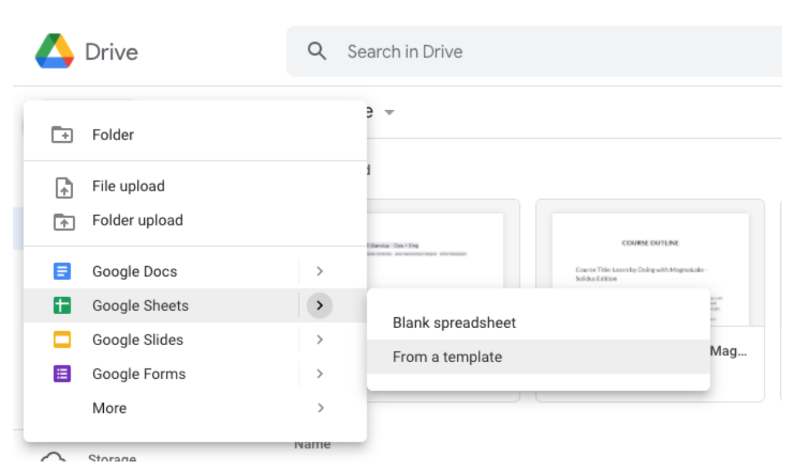
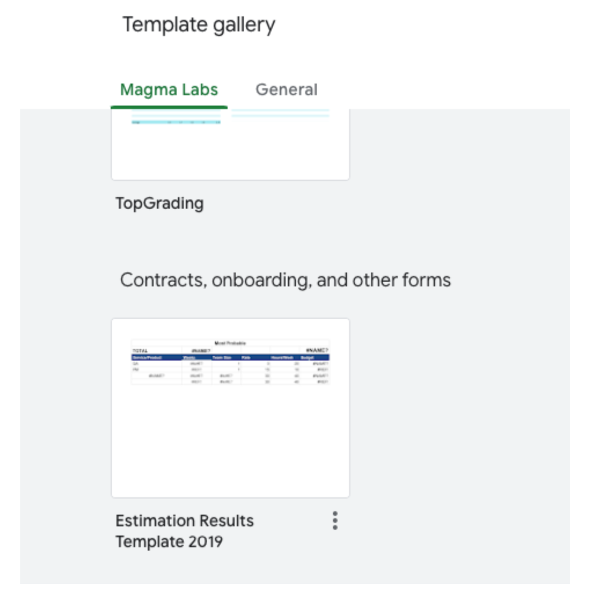

# Project Estimation

Take some time analyzing all the features required by this project. Use our estimation template that you can use from Google Spreadsheet as follows:

### Step 1

### Step 2

### Step 3
Once you get there, pass the feature listing on the document and estimate times for building the product, this would give you some idea and concepts that will help you when you start building.

If you have not performed estimation, go and read our [estimation process](https://github.com/magma-labs/magmalabs-policies/blob/53298b02e67d104b809092e905558d58c969abc2/processes/estimations.md)
